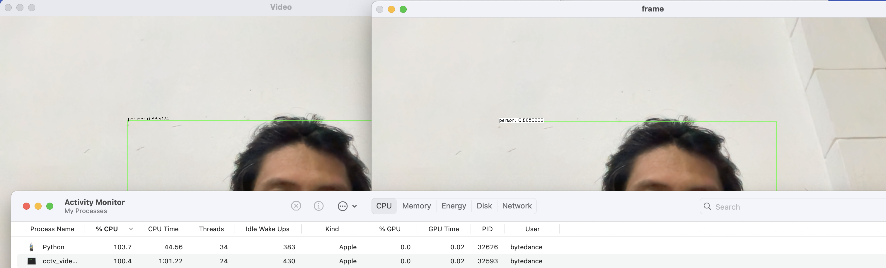

# CCTV (IP CAM) Video Processing
Accesing IP CAM (CCTV) using RTSP protocol and proces using OPENCV and Deep learning (Mobilenet SSD) object detection

#### environment setup
1. install FFMPEG (before install opencv)
2. install opencv 

#### build & run
1. mkdir build && cd build 
2. cmake ..
3. make
4. ./cctv_video_processing_cpp

#### object detection using dnn MobilenetSSD
https://gist.github.com/yiling-chen/7d36389192d54f89a5fe0b810ac7bdf3

#### people counter 
https://github.com/intel-iot-devkit/people-counter-opencv/blob/master/people_counter.cpp

#### benchmarking DNN (different language)
1. using python script (from here https://github.com/djmv/MobilNet_SSD_opencv)
   